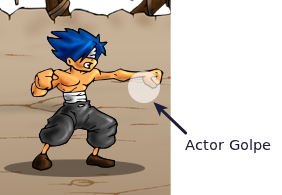

Shaolin's Blind Fury - Manual para desarrolladores
==================================================

Introducción
------------

Este documento es una guia práctica para todos
los desarrolladores que quieran ver o modificar
el código del videojuego ``Shaolin's Blind Fury``.

El documento está separado en varias partes para simplificar
la lectura, pero se intentará mostrar todas las decisiones
de diseño y las estrategias que hacen funcionar al juego.

El protagonista: Shaolin
------------------------

El código del protagonista del juego está en el
directorio ``shaolin``. Gran parte de su funcionalidad
está en dividida en estados.

Para diseñar al shaolin, se usa el patrón de diseño ``state``, en
donde el personaje implementa cada uno de sus movimientos (o
estados) en un objeto, y cada vez que hace algo distinto
simplemente cambia de estado.

Por ejemplo, para hacer que el personaje se quede parado, se
ejecuta esta sentencia:

.. code-block:: python

    shaolin.hacer(estados.Parado()

Este método ``hacer``, toma un objeto comportamiento, y cada
vez que se actualiza al shaolin, se actualiza su comportamiento
también.

De esta forma, queda muy bien definido en qué momento el
personaje ``entra`` en un estado, ``permanece`` en un estado, e
incluso ``cuándo`` sale de un estado.

La codificación del método ``hacer`` está en ``pilas-engine``, pero
se puede ver su código haciendo esto::

    >>> pilas.ver(pilas.actores.Actor.hacer)

Básicamente, un actor tiene una lista de comportamientos, y cuando
llamamos a ``hacer``, ``pilas-engine`` se encarga de tomar el comportamiento
actual y reemplazarlo por otro.

Estados
_______

Los estados del shaolin están en el archivo ``shaolin/estados.py``. Puse a todos
los estados juntos porque tienen mucho en común, casi todos comparten la
misma estructura y son parte del mismo personaje.

Entonces, un estado del personaje es una clase que hereda de los comportamientos
de ``pilas-engine``. Y esta clase tiene una serie de métodos especiales
que permite hacer que el estado interactúe con ``pilas-engine`` y sea parte
de la interacción.

Todo comportamiento tiene que tener un método ``iniciar`` y un método ``actualizar``.

El método ``iniciar`` es invocado por el propio motor ``pilas-engine`` cuando
tiene que llamar al método ``hacer`` sobre un actor. Y el método ``actualizar``
se llama cada vez que se procesa el ``main-loop`` del juego, esto es
exactamente 60 veces por segundo (en ``pilas-engine`` esta frecuencia es fija
en todas las computadoras, lo que puede variar son los fps con que se muestra
(etapa gráfica), pero no la cantidad de veces que es actualizan los actores
(etapa lógica)).

Animaciones
___________

Las animaciones de los personajes están basadas en el código
del actor ``pilas.actores.Cooperativista``, en donde hay solo
tres métodos realmente necesarios para hacer animaciones de un personaje.

Básicamente, las animaciones se guardan en archivos separados, un archivo
por cada animación. Y cada archivo es una grilla en donde están los cuadros
de animación.

Por ejemplo, el archivo ``../data/shaolin/camina.png`` que vemos a continuación:

.. image:: ../data/shaolin/camina.png

tiene todos los cuadros de animación del personaje caminando.

Esta imagen se carga en un diccionario llamado ``animaciones``, dentro
de la clase del shaolin, y luego se controla desde los estados (o comportamientos)
del archivo ``shaolin/estados.py``.

Este es un ejemplo de código reducido de cómo animar un personaje desde
un estado::

    class Caminar(Comportamiento):

        def iniciar(self, shaolin):
            Comportamiento.iniciar(self, shaolin)
            self.shaolin.cambiar_animacion('camina')

        def actualizar(self):
            self.shaolin.avanzar_animacion(0.2)

En el método ``iniciar``, se le dice al shaolin que muestre la animación para
``camina``. Dónde ``camina`` es la clave del diccionario de animaciones, y luego
en ``actualizar`` se pide que avance la animación con una velocidad de ``0.2``, esto
es aproximadamente avanzar 12 cuadros cada un segundo.

Para calcular la velocidad de las animaciones, se puede pensar en la siguiente
cuenta::

    >>> cuandros_a_avanzar_por_segundo = 60 * velocidad

y en este caso daría 12 porque::

    >>> cuandros_a_avanzar_por_segundo = 60 * 0.2
    >>> print cuandros_a_avanzar_por_segundo
    12

Igual, este valor de animación lo calculé probando una y otra vez el
juego ajustando el valor de la velocidad. Comento acá la relación exacta
que tiene con la velocidad real por si te resulta útil para otros juegos.

Otro motivo de diseño importante, es que cuando uno quiere, puede
manipular las animaciones por su cuenta, para casos específicos.

Manejo de teclado
_________________

El manejo de teclado para controlar al ``shaolin`` está hecho
de dos formas.

El movimiento para caminar se está haciendo con el objeto ``pilas.control``, porque
son controles que se pueden mantener presionados mucho tiempo y está bien que
así sea. Por ejemplo, si se quiere avanzar, se deja pulsado el control hacia
la derecha y el ``shaolin`` permanecerá caminando.

En cambio, los controles para golpear o saltar están implementados con eventos, en
la misma clase ``Shaolin``.

Los eventos son distintos porque se disparan una sola vez, cuando se pulsa
la tecla, y no se suelen repetir con tanta frecuencia. Es similar a cuando
se está en editor de textos y se deja pulsada una tecla: el editor imprime
la letra inmediatamente cuando pulsamos la tecla, luego transcurre un segundo
o un poco mas, y recién luego se produce la repetición de pulsaciones.

Para atender los eventos de saltar y golpear se usaron estas lineas de código:

.. code-block:: python

    class Shaolin([...]):

        def __init__(self):
            pilas.eventos.pulsa_tecla.conectar(self.cuando_pulsa_una_tecla
            [...]
    
        def cuando_pulsa_una_tecla(self, evento):
            if evento.codigo == pilas.simbolos.a:
                print "pulsa saltar"
            elif evento.codigo == pilas.simbolos.d:
                print "pulsa golpear" 

sólo que en lugar de imprimir la frase ``pulsa golpear`` o ``pulsa saltar`` se
llama a los métodos ``pulsa_saltar`` o ``pulsa_golpear`` en el comportamiento
actual:

.. code-block:: python

    if evento.codigo == pilas.simbolos.a:
        self.comportamiento_actual.pulsa_saltar()
    [...]
    

Estos eventos, ``pulsa_golpear`` o ``pulsa_saltar`` están definidos en la
clase ``Comportamiento`` del archivo ``shaolin.estados`` y cualquier estado
que esté interesado en esos eventos tiene que redefinir esos métodos.

Por ejemplo, el estado parado reacciona cuando se pulsa saltar, así que
el código simplificado se ve mas o menos así:

.. code-block:: python

    class Parado(Comportamiento):

        def pulsa_golpear(self):
            self.shaolin.hacer(Golpear())

    class Golpear(Comportamiento):

        def iniciar(self, shaolin):
            [...]
            self.shaolin.cambiar_animacion('ataca1')

Sombra
______

La sombra del shaolin es un actor separado, que simplemente se
instancia junto con el shaolin y se mantiene siempre en la
misma posición ``x`` e ``y`` del shaolin.

Conclusiones del shaolin
________________________

Vimos que el ``shaolin`` tiene dos partes muy importantes para analizar
su comportamiento: animaciones y estados.

En resumen, el ``shaolin``:

- Es un gestor de animaciones: carga todas las grillas de cuadros y permite intercambiarlas mediante métodos cómo ``cambiar_animacion`` o ``avanzar_animacion``.
- Está implementado con estados, y cada uno de ellos se encarga de atender eventos y darle el control a otro estado. Para estos se usa el código ``shaolin.hacer(nuevo_estado)``.

Colisiones
==========

Las colisiones se implementaron para permitir que un personaje
le pueda "pegar" a otro.

Cada estado del shaolin tiene un atributo ``golpe``, que casi
siempre apunta al valor ``None``.

Cuando el personaje tiene que lanzar un golpe, se puede llamar
al método ``golpear`` indicando la altura del golpe respecto
de los pies del personaje.

Por ejemplo, en esta versión simplificada del estado Golpear
se ve cómo se llama a este método ``golpear`` y además se cambia 
la animación del shaolin para que lance el puño:

.. code-block:: python

    class Golpear(Comportamiento):

        def iniciar(self, shaolin):
            Comportamiento.iniciar(self, shaolin)

            self.shaolin.cambiar_animacion('ataca1')
            self.shaolin.reproducir_sonido('golpe')
            self.golpear(dy=90)

el método ``golpear``, va a crear un objeto de la clase ``Golpe``, del
archivo ``golpe.py``. Es responsabilidad del estado del shaolin
eliminar este objeto llamando al método ``eliminar_golpe``.

El objeto ``Golpe`` es un actor, y se encarga de saber si el golpe
que emite un personaje logra golpear a otro:

Si quieres hacer que el golpe sea vea, tienes que editar el archivo
``configuracion.py``.

Contacto
--------

El actor ``Golpe`` se mueve por sí solo, porque tiene un método actualizar
y conoce a quien emitió el golpe.

Pero este actor no hace las verificaciones de colisión, eso es algo que se
le tiene que preguntar, y administrar por afuera.

Por ejemplo, en el estado del shaolin ``Golpear``, se construye un
objeto ``Golpe`` y luego se consulta por las colisiones en el método
actualizar.

.. code-block:: python

    class Golpear(Comportamiento):

        def iniciar(self, shaolin):
            Comportamiento.iniciar(self, shaolin)

            self.shaolin.cambiar_animacion('ataca1')
            self.shaolin.reproducir_sonido('golpe')
            self.golpear(dy=90)

        def actualizar(self):
            if self.shaolin.avanzar_animacion(0.4):
                self.shaolin.hacer(Parado())
                self.eliminar_golpe()
                Golpear.ha_golpeado = True
            else:
                if self.golpe:
                    enemigo = self.golpe.verificar_colisiones()                                                                                            
                    if enemigo:
                        print "Ha golpeado al enemigo!!!"
                        self.eliminar_golpe()

